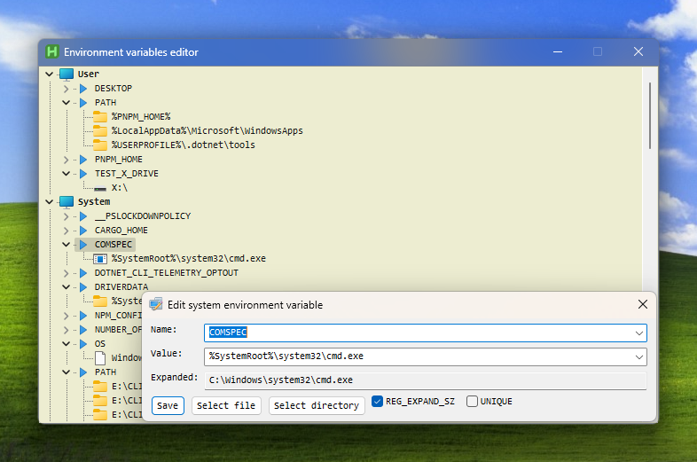

# Environment Variables Editor

[AutoHotkey][ahk] script to edit user and system environment variables in Windows.

      
  

Environment variables specify files, directories, application-specific options,
and other similar information that can be different on different computers.
The system maintains an environment block for each user and one for the computer.

- **User environment variables** are set for the current user only.
- **System environment variables** are set for all users on the system.

The name of an environment variable cannot include an equal sign (`=`).

The `PATH` environment variable is a special variable that specifies the directories in which certain types of
files are located on the computer that can be referenced without knowing and typing the whole path to the file.
Directories are separated by semicolons (`;`), and those that contain semicolons in the path are surrounded by double quotes (`"`).

The `PATHEXT` environment variable stores a list of extensions that determines what types of files to look for and in what order within each directory specified in the `PATH` environment variable.

The script allows you to add multiple values to any variable, by separating them with semicolons, just like the `PATH` variable.

### Hotkeys

Hotkeys that perform an action when the script window is active.

| Hotkey | Description |
| :---: | --- |
| [<kbd>F5</kbd>][reload] | Replaces the currently running instance of the script with a new one. |
| [<kbd>XButton1</kbd>][xbutton] | [4th mouse button] Moves the selected environment variable value up. |
| [<kbd>XButton2</kbd>][xbutton] | [5th mouse button] Moves the selected environment variable value down. |

## Download

<https://github.com/flipeador/environment-variables-editor/releases>

<!-- Reference Links -->
[ahk]: https://www.autohotkey.com
[reload]: https://www.autohotkey.com/docs/v2/lib/Reload.htm
[xbutton]: https://www.autohotkey.com/docs/v2/KeyList.htm#mouse-advanced
